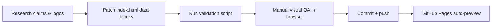

# Industry Map Maker Skill (with Anime Showcase)

[English](README.md) | [简体中文](README.zh-CN.md)

<p align="center">
  <a href="https://soujiokita98.github.io/industry-map-maker-skill/">
    
  </a>
</p>

## Live Demo

[Open Interactive Map](https://soujiokita98.github.io/industry-map-maker-skill/)

## At a Glance

This repository is a reusable skill for building interactive industry maps in a single `index.html`.

Current showcase:
- Anime/ACG ecosystem map
- 88 nodes, 103 connections
- evidence-tiered edges (`FACT-H`, `FACT-M`, `POTENTIAL`, `HYP`)
- AI opportunity overlays by value-chain layer

## Quick Start (60 Seconds)

```bash
git clone https://github.com/SoujiOkita98/industry-map-maker-skill.git
cd industry-map-maker-skill
python3 -m http.server 8000
```

Open:
- [http://localhost:8000/index.html](http://localhost:8000/index.html)

Validate:
```bash
bash scripts/validate_map.sh
```

## How To Use With Codex / Claude Code

1. Set this repo as the working directory.
2. Ask the agent to read `SKILL.md` first.
3. Give a scoped task (data, logos, layout, validation).
4. Require `bash scripts/validate_map.sh` before completion.

Starter prompt:
```text
Read SKILL.md first. Add 3 strongly relevant AI startups to this map with FACT/POTENTIAL/HYP classification, USD-consistent market text, and high-quality logos. Run bash scripts/validate_map.sh before finishing.
```

## Workflow



An interactive, single-file map framework that demonstrates:

- a full industry value chain
- key companies and startups
- relationship types (ownership, licensing, distribution, tech, hypotheses)
- AI opportunity overlays by layer

The current concrete example is anime/ACG, but the core deliverable is the reusable skill + workflow for building visual relationship maps in any domain.

## Why This Repo Exists

This project provides a reusable pattern for any industry map:

- one HTML artifact (`index.html`) for easy sharing/deployment
- a maintainer skill (`SKILL.md`) to guide future AI agents
- evidence-tiered relationship modeling (`FACT-H`, `FACT-M`, `POTENTIAL`, `HYP`)
- USD-normalized market annotation policy

## Project Structure

```text
.
├── index.html                                 # Main interactive map (data + rendering + UI)
├── SKILL.md                                   # Canonical maintainer skill for AI agents
├── skills.md                                  # Backward-compat pointer to SKILL.md
├── docs/
│   └── AGENT_PROMPT_TEMPLATES.md              # Copy-paste prompts for common agent tasks
├── scripts/
│   ├── validate_map.sh                        # Syntax/integrity/sensitivity checks
│   └── logo_probe.sh                          # Quick logo URL probe helper
├── templates/
│   └── evidence_log_template.csv              # Edge evidence tracking template
├── research/
│   └── 2026-02-09/
│       ├── market_landscape_vc_grade_2026-02-09.md
│       ├── connection_validation_2026-02-09.csv
│       ├── ai_startups_validation_2026-02-09.md
│       └── ai_startups_round2_validation_2026-02-09.md
└── .gitignore
```

## GitHub Pages Preview (Best Practice)

This repo includes an Actions workflow for Pages deploy:

- `.github/workflows/deploy-pages.yml`

After pushing to GitHub:

1. Go to `Settings` -> `Pages`
2. Under **Source**, choose: `GitHub Actions`
3. Push to `main` (or run workflow manually in Actions tab)
4. Your live preview URL will appear in the workflow summary and Pages settings

This repo live URL:
- [https://soujiokita98.github.io/industry-map-maker-skill/](https://soujiokita98.github.io/industry-map-maker-skill/)

## Replicate This For Another Industry

Use this repo as a template:

1. Duplicate this directory.
2. Replace `LAYERS`, `NODES`, and `CONNECTIONS` in `index.html`.
3. Keep evidence-tier logic (`getConnMeta`) and interaction controls.
4. Keep market text in USD only.
5. Update `SKILL.md` for the new domain so agents can continue iterating safely.

## Data Quality & Interpretation

- Not every edge is an audited contract.
- Relationship classes intentionally separate fact vs potential vs hypothesis.
- Market figures are mixed-confidence by source availability; review the research notes before investment decisions.

## Logo Sourcing Guide

Use this order for reliable logos:

1. Official company assets (brand/media kit, investor/corporate pages)
2. Official site-hosted logo URL (direct `logo.svg/png/webp`)
3. Domain favicon (`google s2`) for fallback
4. Clearbit fallback

Practical rule:
- If favicon is low quality or wrong brand, set explicit `node.logo` in `index.html`.

Quick URL checks:

```bash
# check status + payload size
curl -L -s -o /tmp/logo.bin -w "%{http_code} %{size_download}\n" "https://example.com/logo.png"

# check multiple logo URLs
for u in "https://example.com/logo.svg" "https://www.google.com/s2/favicons?domain=example.com&sz=256"; do
  echo "--- $u"
  curl -L -s -o /tmp/logo.bin -w "%{http_code} %{size_download}\n" "$u"
done
```

Script helper:

```bash
bash scripts/logo_probe.sh \
  "https://example.com/logo.svg" \
  "https://www.google.com/s2/favicons?domain=example.com&sz=256"
```

## Cross-Validation Guide (Edges & Claims)

For each important edge, validate with primary sources first:

- ownership/investment: company IR, SEC filings
- licensing/distribution: official announcements, platform release pages
- startup applicability edges: official product docs/case studies (`POTENTIAL` unless contract-level proof)

Recommended evidence fields (when you extend the data model):
- `source_url`
- `as_of`
- `evidence_type` (`official_filing`, `official_announcement`, `case_study`, `inference`)
- `confidence` (`high`, `med`, `low`)

You can track these in:
- `templates/evidence_log_template.csv`

Fast hygiene scan:

```bash
rg -n "(/Users/|api[_-]?key|secret|token|password|BEGIN [A-Z ]+ KEY|\\.claude|manus\\.space)"
```

## Public Release Notes

- Local agent config (`.claude/`) is ignored via `.gitignore`.
- Before publishing updates, run the validation and sensitivity scan commands listed in `SKILL.md`.
