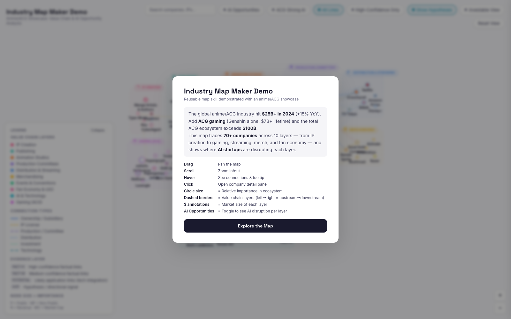

# Industry Map Maker Skill

[English](README.md) | [简体中文](README.zh-CN.md)

<p align="center">
  <a href="https://soujiokita98.github.io/industry-map-maker-skill/">
    
  </a>
</p>

## Live Demo

[https://soujiokita98.github.io/industry-map-maker-skill/](https://soujiokita98.github.io/industry-map-maker-skill/)

## One-Line For Any Agent

```text
Read SKILL.md and then improve index.html with only high-signal changes (USD-only numbers, correct FACT-H/FACT-M/POTENTIAL/HYP edges, better logos), run bash scripts/validate_map.sh, and return changes + rationale + confidence.
```

## What This Repo Is

A public, reproducible example for building industry relationship maps with AI agents.

- Core artifact: `index.html` (single-file interactive map)
- Core instruction set: `SKILL.md` (what agents should do)
- Showcase domain: Anime/ACG (replaceable)

## Disclaimer (Best Results)

For best results, clone this entire repository and run your agent inside this repo root.  
The strongest workflow is: let the agent learn this repository context first (`SKILL.md`, `index.html`, scripts, and examples), then execute map updates from there.

## 1-Minute Setup

```bash
git clone https://github.com/SoujiOkita98/industry-map-maker-skill.git
cd industry-map-maker-skill
python3 -m http.server 8000
```

Open: [http://localhost:8000/index.html](http://localhost:8000/index.html)

## Use It With Any Agent

Paste this to your agent:

```text
Read SKILL.md first. Then improve this map with high-signal changes only.
Requirements:
1) Keep all money values in USD.
2) Classify each new edge as FACT-H / FACT-M / POTENTIAL / HYP.
3) Use high-quality official logos whenever possible.
4) Validate before finishing with: bash scripts/validate_map.sh.
Return: (a) what changed, (b) why, (c) confidence and sources for major claims.
```

## OpenClaw (Optional)

OpenClaw loads skills from:
- `<workspace>/skills` (highest precedence)
- `~/.openclaw/skills`

So the easiest way is to place this skill as a folder that contains `SKILL.md`.

One-line install into current workspace:

```text
mkdir -p skills/industry-map-maker-skill && curl -L https://raw.githubusercontent.com/SoujiOkita98/industry-map-maker-skill/main/SKILL.md -o skills/industry-map-maker-skill/SKILL.md
```

By default, newly installed skills are guaranteed in the next OpenClaw session.
If Skill Watcher is enabled, changes can hot-reload and become available on the next turn in the current session.

Reference: [OpenClaw Skills Docs](https://docs.openclaw.ai/tools/skills)

## Repo Layout (Simple)

```text
index.html                         # interactive map
SKILL.md                           # agent playbook (read first)
scripts/validate_map.sh            # integrity + sensitivity checks
scripts/logo_probe.sh              # logo URL probe helper
docs/AGENT_PROMPT_TEMPLATES.md     # extra prompts
templates/evidence_log_template.csv
research/2026-02-09/               # example research snapshots
```

## Quality Bar

- Evidence-aware edges, not random lines
- USD-only financial/market text
- Clear visual hierarchy and readable labels
- Reproducible validation before every push

## Publish / Preview

This repo is configured for GitHub Pages via `.github/workflows/deploy-pages.yml`.
Once pushed to `main`, the preview updates automatically.
