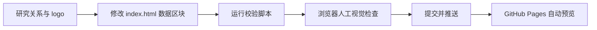

# Industry Map Maker Skill（含 Anime 示例）

[English](README.md) | [简体中文](README.zh-CN.md)

## 在线预览

[打开交互地图](https://soujiokita98.github.io/industry-map-maker-skill/)

## 一眼看懂

这个仓库是一个可复用的行业关系图技能，用单个 `index.html` 交付交互式地图。

当前示例：
- Anime/ACG 生态地图
- 88 个节点、103 条关系
- 证据分层关系（`FACT-H`、`FACT-M`、`POTENTIAL`、`HYP`）
- 按价值链展示 AI 机会层

## 60 秒快速开始

```bash
git clone https://github.com/SoujiOkita98/industry-map-maker-skill.git
cd industry-map-maker-skill
python3 -m http.server 8000
```

打开：
- [http://localhost:8000/index.html](http://localhost:8000/index.html)

校验：
```bash
bash scripts/validate_map.sh
```

## 与 Codex / Claude Code 配合（推荐）

1. 将本仓库设为当前工作目录。
2. 先让 agent 读取 `SKILL.md`。
3. 给出明确的小范围任务（数据、logo、布局、校验）。
4. 要求完成前运行 `bash scripts/validate_map.sh`。

起步提示词：
```text
Read SKILL.md first. Add 3 strongly relevant AI startups to this map with FACT/POTENTIAL/HYP classification, USD-consistent market text, and high-quality logos. Run bash scripts/validate_map.sh before finishing.
```

## 工作流（可视化）



这是一个可交互的单文件产业地图框架，用于演示：

- 某个行业的完整价值链
- 关键公司与 AI 创业公司
- 关系类型（股权、授权、分发、技术、假设）
- 分层 AI 机会覆盖

当前示例内容是 Anime/ACG，但核心是可复用的技能与流程：你可以用它快速搭建其他行业关系图，并配合 Codex/Claude Code 持续迭代。

## 为什么做这个仓库

这个项目提供了一套可复制的行业地图方法：

- 单一 HTML 成品（`index.html`）便于分享和部署
- 维护技能文档（`SKILL.md`）便于后续 AI 接手
- 证据分层关系模型（`FACT-H`, `FACT-M`, `POTENTIAL`, `HYP`）
- 市场规模统一为 USD 口径

## 项目结构

```text
.
├── index.html                                 # 主地图（数据 + 渲染 + 交互）
├── SKILL.md                                   # 规范化维护指引（给 AI agent）
├── skills.md                                  # 兼容旧文件名，指向 SKILL.md
├── docs/
│   └── AGENT_PROMPT_TEMPLATES.md              # 常见任务提示词模板
├── scripts/
│   ├── validate_map.sh                        # 一键校验（语法/完整性/敏感扫描）
│   └── logo_probe.sh                          # logo 链接快速探测
├── templates/
│   └── evidence_log_template.csv              # 边证据记录模板
├── research/
│   └── 2026-02-09/
│       ├── market_landscape_vc_grade_2026-02-09.md
│       ├── connection_validation_2026-02-09.csv
│       ├── ai_startups_validation_2026-02-09.md
│       └── ai_startups_round2_validation_2026-02-09.md
└── .gitignore
```

## GitHub Pages 在线预览（推荐做法）

本仓库已内置 GitHub Pages 的 Actions 工作流：

- `.github/workflows/deploy-pages.yml`

推送到 GitHub 后：

1. 打开 `Settings` -> `Pages`
2. 在 **Source** 中选择：`GitHub Actions`
3. 推送到 `main` 分支（或在 Actions 页面手动触发）
4. 工作流完成后，可在 Pages 设置页和工作流摘要中看到线上地址

本仓库线上地址：
- [https://soujiokita98.github.io/industry-map-maker-skill/](https://soujiokita98.github.io/industry-map-maker-skill/)

## 如何复用到其他行业

1. 复制这个目录作为模板。
2. 在 `index.html` 里替换 `LAYERS`、`NODES`、`CONNECTIONS`。
3. 保留证据分层逻辑（`getConnMeta`）和交互控制。
4. 市场规模保持 USD 口径。
5. 按新行业更新 `SKILL.md`，保证后续 agent 可持续维护。

## 数据质量与解释边界

- 不是每条边都代表已披露合同。
- 图里明确区分了事实、潜在应用、假设。
- 市场数字受来源可得性影响，使用前请结合研究文档复核。

## Logo 来源建议

优先级：

1. 官方品牌/IR 资源
2. 官方站点直接 logo 文件（`logo.svg/png/webp`）
3. 域名 favicon（Google s2）
4. Clearbit 兜底

若默认 logo 质量差或品牌不正确，请在 `index.html` 中为该节点设置显式 `node.logo`。

快速检测：

```bash
bash scripts/logo_probe.sh \
  "https://example.com/logo.svg" \
  "https://www.google.com/s2/favicons?domain=example.com&sz=256"
```

## 关系交叉验证建议

高风险关系优先做一手验证：

- 股权/投资：IR、SEC、官方公告
- 授权/分发：官方公告、平台发布页
- AI 适配边：产品文档/案例（无合同证明时归类为 `POTENTIAL`）

建议记录字段：

- `source_url`
- `as_of`
- `evidence_type`（`official_filing` / `official_announcement` / `case_study` / `inference`）
- `confidence`（`high` / `med` / `low`）

可使用模板：

- `templates/evidence_log_template.csv`

## 公开发布说明

- 本地 agent 配置（`.claude/`）已通过 `.gitignore` 排除。
- 发布前建议运行 `SKILL.md` 中的验证和敏感信息扫描命令。
