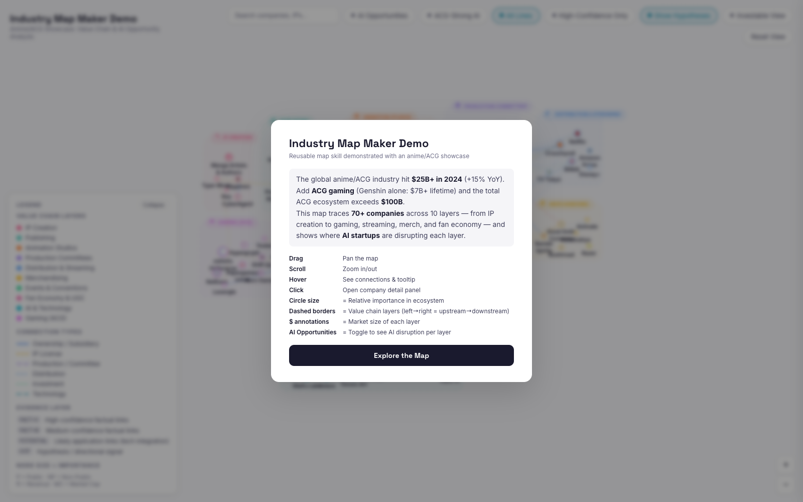

# Industry Map Maker Skill

[English](README.md) | [简体中文](README.zh-CN.md)

<p align="center">
  <a href="https://soujiokita98.github.io/industry-map-maker-skill/">
    
  </a>
</p>

## 快速开始 — 只需要 Skill 文件？

> **不需要 clone 整个仓库。** 直接下载 `.skill` 文件，拖入 Claude 即可使用：
>
> [**industry-map-maker.skill**](./industry-map-maker.skill) — 适用于任何行业，完全自包含。

---

## 在线预览

[https://soujiokita98.github.io/industry-map-maker-skill/](https://soujiokita98.github.io/industry-map-maker-skill/)

## 给任意 Agent 的一行指令

```text
Read SKILL.md and then improve index.html with only high-signal changes (USD-only numbers, correct FACT-H/FACT-M/POTENTIAL/HYP edges, better logos), run bash scripts/validate_map.sh, and return changes + rationale + confidence.
```

## 这个仓库是什么

这是一个公开、可复用的行业关系图样板仓库，专门给 AI agent 学习和执行。

- 核心产物：`index.html`（单文件交互地图）
- 核心规则：`SKILL.md`（agent 执行说明）
- 当前示例：Anime/ACG（可替换为任何行业）

## 安装为 Claude Skill

下载通用版 skill（适用于任何行业，不仅限于动漫）：

[**📦 industry-map-maker.skill**](./industry-map-maker.skill)

这个 `.skill` 文件打包了完整的通用行业地图制作流程：证据分层边、USD 统一口径、单文件 HTML 输出、验证脚本和研究参考文档。拖入 Claude skills 即可使用。

仓库中的 `SKILL.md` 是针对 Anime/ACG 示例的。`.skill` 文件是通用版本，适用于任何行业 —— AI 硬件、企业 SaaS、软饮料，任何你需要做行业图谱的方向。

**`.skill` 文件包含：**
- `SKILL.md` — 主指令集（创建新地图 + 迭代改进已有地图）
- `references/data-schema.md` — 节点、边、层数据格式
- `references/evidence-policy.md` — FACT-H / FACT-M / POTENTIAL / HYP 分类标准
- `references/html-template-guide.md` — 单文件 HTML 引擎工作原理
- `scripts/validate_map.sh` — 完整性 + 币种 + 敏感信息检查
- `scripts/logo_probe.sh` — Logo URL 探测工具
- `templates/evidence_log_template.csv` — 证据记录模板

## 免责声明（最佳效果）

想要最好的效果，建议先完整 clone 这个仓库，并让 agent 在仓库根目录内工作。  
最佳实践是先让 agent 学习本仓库上下文（`SKILL.md`、`index.html`、脚本和示例），再开始执行地图更新任务。

## 1 分钟启动

```bash
git clone https://github.com/SoujiOkita98/industry-map-maker-skill.git
cd industry-map-maker-skill
python3 -m http.server 8000
```

打开：[http://localhost:8000/index.html](http://localhost:8000/index.html)

## 与任意 Agent 一起用

把下面这段直接贴给 agent：

```text
Read SKILL.md first. Then improve this map with high-signal changes only.
Requirements:
1) Keep all money values in USD.
2) Classify each new edge as FACT-H / FACT-M / POTENTIAL / HYP.
3) Use high-quality official logos whenever possible.
4) Validate before finishing with: bash scripts/validate_map.sh.
Return: (a) what changed, (b) why, (c) confidence and sources for major claims.
```

## OpenClaw（可选）

OpenClaw 会从以下目录加载技能：
- `<workspace>/skills`（优先级最高）
- `~/.openclaw/skills`

所以最简单方式是放一个包含 `SKILL.md` 的技能目录。

一行安装到当前工作区：

```text
mkdir -p skills/industry-map-maker-skill && curl -L https://raw.githubusercontent.com/SoujiOkita98/industry-map-maker-skill/main/SKILL.md -o skills/industry-map-maker-skill/SKILL.md
```

默认情况下，新安装的 skill 会在下一个 OpenClaw 会话中稳定生效。
如果开启 Skill Watcher，当前会话可热更新，并在下一轮 turn 可用。

参考文档：[OpenClaw Skills Docs](https://docs.openclaw.ai/tools/skills)

## 目录（简版）

```text
index.html                         # 交互地图
SKILL.md                           # agent 执行手册（先读）
industry-map-maker.skill           # 通用版 skill（适用任何行业）
scripts/validate_map.sh            # 完整性 + 敏感信息检查
scripts/logo_probe.sh              # logo 链接探测
docs/AGENT_PROMPT_TEMPLATES.md     # 更多提示词
templates/evidence_log_template.csv
research/2026-02-09/               # 示例研究快照
```

## 质量标准

- 关系边有证据分层，不是随意连线
- 市场和财务口径统一为 USD
- 可读性优先（字体、层次、线条）
- 每次提交前可复现验证

## 发布与预览

仓库已配置 GitHub Pages（`.github/workflows/deploy-pages.yml`）。
推送到 `main` 后会自动更新预览。
